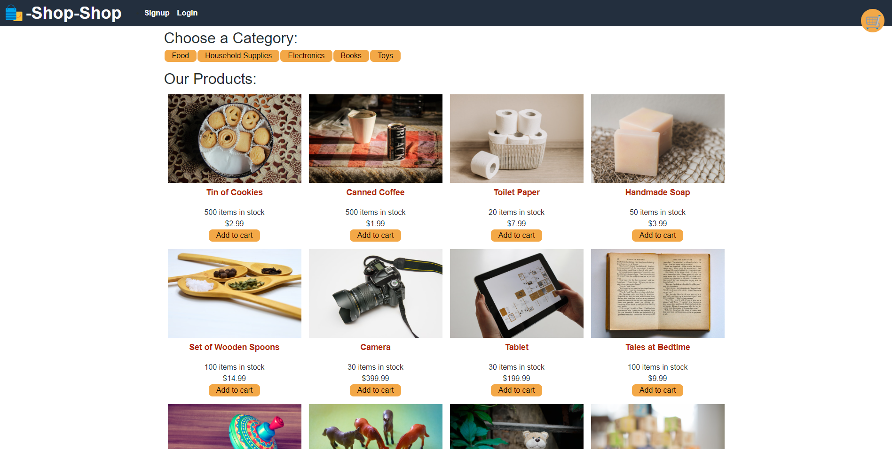

  # Shop Shop (Redux Global State)
  
  This application hosts a React SPA ecommerce site that uses Redux to manage global state. Users are able to browse, add, and remove items from their carts and pay for their items using Stripe.
  
  ## Table of Contents
  
  * [Installation](#installation)
  * [Built With](#built)
  * [Usage Information](#usage)
  * [Authors & Acknowledgements](#credits)
  * [Contact](#questions)
  
  
  
  ## Installation
  This application can be accessed using the live link. To run this application locally, after cloning the repository and installing all dependencies, use the command "npm run develop" to start both the backend and frontend of the application.
  
  ## Built With
  * React
  * MongoDB
  * Apollo
  * GraphQL
  * Express
  * Stripe

  ## Usage Information
  [Shop Shop](https://apricot-cake-50528.herokuapp.com/) 
    
  This application is a sample ecommerce site and though the application has capacity to take and authorize payment information, this ecommerce site is strictly a mock up and there is no real inventory available to be purchased. 
    
    
  ## Authors & Acknowledgements
  
  © 2020 - 2022 Trilogy Education Services, a 2U, Inc. brand. All Rights Reserved.
  
  Made by [TOVTC](https://github.com/TOVTC).

  ## Questions?
  Contact repository author via [GitHub](https://github.com/TOVTC). 
    
  
  